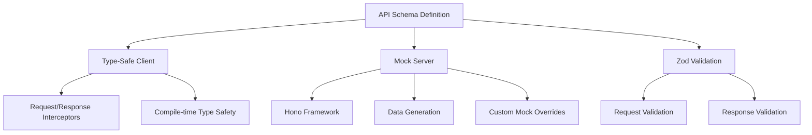
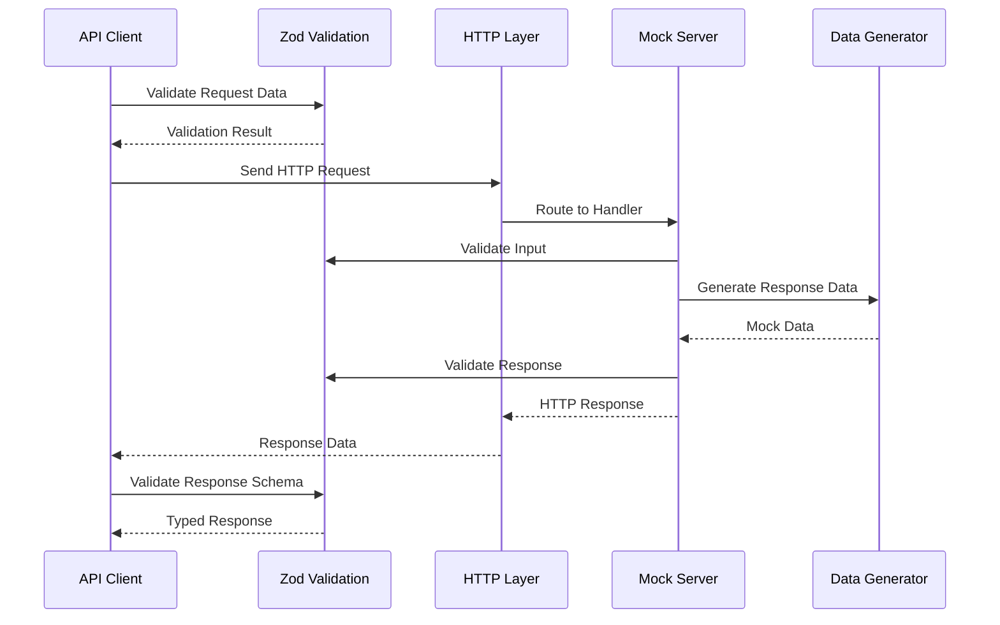

# Design Document

## Overview

MockDash is a TypeScript library that provides a unified approach to API development by allowing developers to define their API contract once using Zod schemas and automatically generating both a type-safe client and a mock server. The library follows a schema-first approach where the API definition serves as the single source of truth for both client and server implementations.

The core architecture consists of three main components:

1. **Schema Definition System** - Allows developers to define API endpoints with input/output validation
2. **Type-Safe Client Generator** - Creates a fully typed API client with interceptors and validation
3. **Mock Server Generator** - Produces a Hono-based server with automatic data generation and custom overrides

## Architecture

### High-Level Architecture



### Core Components

#### 1. Schema Definition System

- **Purpose**: Provide a declarative way to define API endpoints with full type information
- **Key Features**:
  - HTTP method and path specification using `@{method}/{path}` convention
  - Input validation for query parameters, path parameters, JSON body, and form data
  - Response schema definition with Zod types
  - Support for custom mock data generators

#### 2. API Client Generator

- **Purpose**: Generate a fully type-safe client that validates requests and responses
- **Key Features**:
  - Automatic TypeScript type inference from schemas
  - Runtime validation of requests and responses
  - Interceptor system for request/response transformation
  - Framework-agnostic design
  - Custom error handling with typed error classes

#### 3. Mock Server Generator

- **Purpose**: Create a functional Hono-based server for development and testing
- **Key Features**:
  - Automatic endpoint generation from schemas
  - Integration with Zod-compatible faker libraries
  - Custom mock data override system
  - Middleware support for CORS, authentication, etc.
  - Request validation and appropriate error responses

## Components and Interfaces

### Core Types and Interfaces

```typescript
// Main API Schema type
type ApiSchema = {
  [KEY in `@${HttpMethod}/${string}`]: Endpoint
} & Record<string, Endpoint>

// Endpoint definition
interface Endpoint<T extends z.ZodType = z.ZodType | z.ZodArray<z.ZodType>> {
  input?: {
    query?: z.ZodObject<Record<string, z.ZodType>>
    param?: z.ZodObject<Record<string, z.ZodType>>
    json?: z.ZodObject<Record<string, z.ZodType>>
    form?: z.ZodObject<Record<string, ZodFormValue>>
    header?: z.ZodObject<Record<string, z.ZodType>>
  }
  response: T
  faker?: ApiResponseGenerator<any, T>
}

// Client function signature
type ClientFn<T extends ApiSchema> = <K extends keyof T>(
  key: K,
  ...args: Args<T, K>
) => Promise<z.infer<T[K]['response']>>
```

### Schema Definition API

The library provides three main functions for schema definition:

1. **`defineApiSchema(schema)`** - Defines the base API schema without mock data
2. **`defineMockServerSchema(schema, customMocks)`** - Combines base schema with custom mock overrides
3. **`defineApiMock(schema, mocks)`** - Defines only the mock data for existing schemas

### Client Generation API

The `createApiClient` function accepts:

- `apiSchema`: The API schema definition
- `baseURL`: Base URL for all API calls
- `transformRequest`/`transformResponse`: Legacy interceptor support
- Standard fetch options (headers, credentials, etc.)

Returns a client function with interceptor properties:

```typescript
interface Client<T extends ApiSchema> {
  (key: keyof T, data?: InputData): Promise<ResponseData>
  interceptors: {
    request: InterceptorManager<T, FetchOptions>
    response: InterceptorManager<T, Response>
  }
}
```

### Mock Server Generation API

The `generateMockApi` function accepts:

- `apiSchema`: The API schema with optional faker definitions
- `fake`: Function to generate fake data from Zod schemas
- `options`: Configuration including base path and middleware setup

Returns:

```typescript
{
  app: Hono // The configured Hono application
  mockContext: Map<string, unknown> // Shared state between mock handlers
}
```

## Data Models

### Request/Response Flow



### Type System Integration

The library leverages TypeScript's type system extensively:

1. **Path Parameter Extraction**: Automatically extracts path parameters from endpoint keys
2. **Input Type Inference**: Combines all input types (query, param, json, form) into a single type
3. **Response Type Safety**: Ensures response types match the defined Zod schemas
4. **Conditional Types**: Uses conditional types to make parameters optional when no input is required

### Error Handling Model

```typescript
// Base error classes
class ApiError extends Error {
  status: number
  body?: unknown
}

class ValidationError extends ApiError {
  validationErrors: z.ZodError
}

class MockError extends Error {
  status: ContentfulStatusCode
}
```

## Error Handling

### Client-Side Error Handling

1. **Request Validation Errors**: Thrown when input data doesn't match the schema
2. **Network Errors**: Standard fetch errors (network issues, timeouts)
3. **HTTP Status Errors**: Non-2xx responses with structured error information
4. **Response Validation Errors**: When server response doesn't match expected schema

### Server-Side Error Handling

1. **Input Validation**: Automatic validation using Hono's zValidator middleware
2. **Custom Mock Errors**: MockError class for simulating specific error scenarios
3. **Schema Validation**: Response validation before sending data to client

### Error Response Format

```typescript
interface ErrorResponse {
  message: string
  status: number
  validationErrors?: z.ZodError['issues']
}
```

## Testing Strategy

### Unit Testing Approach

1. **Schema Definition Tests**
   - Validate schema parsing and type inference
   - Test endpoint key parsing and validation
   - Verify input/output type combinations

2. **Client Generation Tests**
   - Test type-safe client generation
   - Validate request/response interceptors
   - Test error handling scenarios
   - Verify framework-agnostic usage

3. **Mock Server Tests**
   - Test automatic endpoint generation
   - Validate fake data generation
   - Test custom mock overrides
   - Verify middleware integration

### Integration Testing

1. **End-to-End Workflow Tests**
   - Define schema → Generate client → Make requests → Validate responses
   - Test with different Zod schema types and combinations
   - Verify interceptor chains work correctly

2. **Framework Integration Tests**
   - Test client usage with React, Vue, Svelte
   - Verify compatibility with popular libraries (TanStack Query, SWR)

### Performance Testing

1. **Type Compilation Performance**
   - Measure TypeScript compilation time with large schemas
   - Test memory usage during type inference

2. **Runtime Performance**
   - Benchmark request/response validation overhead
   - Test mock server response times

### Testing Tools and Setup

- **Unit Tests**: Vitest with happy-dom for fast unit testing
- **Type Tests**: TypeScript compiler API for type-level testing
- **Integration Tests**: Playwright for HTTP endpoint testing
- **Framework Tests**: Testing utilities for React, Vue, Svelte

## Implementation Considerations

### TypeScript Complexity Management

The library uses advanced TypeScript features that need careful management:

- Template literal types for endpoint key parsing
- Conditional types for optional parameter handling
- Mapped types for input/output transformation
- Type-level recursion for nested schema processing

### Performance Optimizations

1. **Lazy Validation**: Only validate when necessary
2. **Schema Caching**: Cache parsed schemas to avoid re-parsing
3. **Type Inference Optimization**: Use helper types to reduce compilation overhead

### Extensibility Points

1. **Custom Validators**: Allow custom validation beyond Zod
2. **Transport Layer**: Support for different HTTP clients (fetch, axios)
3. **Serialization**: Custom serialization for complex data types
4. **Mock Data Sources**: Integration with different faker libraries

### Browser and Node.js Compatibility

- Use fetch API with polyfill support for older environments
- Ensure Hono mock server works in both Node.js and edge runtimes
- Handle FormData and File uploads across environments
